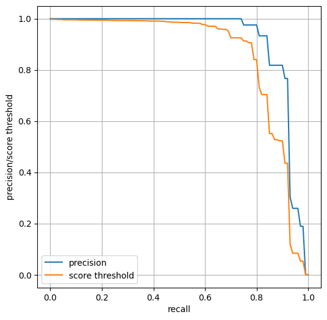
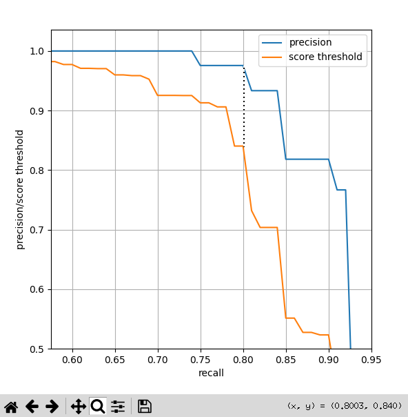

# detectron2-precision-recall

This is a lightweight codebase for conducting precision-recall analysis for models trained in [detectron2](https://github.com/facebookresearch/detectron2). The detectron2 library allows for evaluating average precision (AP) metrics but does not allow for accessing individual precision/recall values. This repo will help you access those values, plot precision-recall curves, and select a score (confidence) threshold suitable for your application.

## Requirements
If you have an environment with [detectron2](https://github.com/facebookresearch/detectron2) installed, there are **no additional dependencies required**. Simply clone or fork this repo.

## Usage
A Jupyter notebook that walks you through training a Mask-RCNN model and performing precision-recall analysis for it is provided in [demo.ipynb](https://github.com/ajzhai/detectron2-precision-recall/blob/master/demo.ipynb). You can also just look at the simple script [run_analysis.py](https://github.com/ajzhai/detectron2-precision-recall/blob/master/run_analysis.py), which plots precision-recall curves for a trained model. You can change the example dataset and model to your own dataset and model. The IoU threshold and class of interest can be specified in the script.

### How to read the plot
The plot will contain both a precision-recall curve and a score-recall curve. The score-recall curve shows the score (confidence) threshold that achieves each recall value. Thus, once you have chosen a point on the precision-recall curve for your model, you can find the score threshold that achieves it by moving vertically to find the point on the score-recall curve with the same x-value. 

For example, if we want to achieve the (precision=0.98, recall=0.80) point here, we should choose a score threshold of 0.84:

## Acknowledgments
Thanks to [detectron2](https://github.com/facebookresearch/detectron2) for the great framework and to Matterport for the [balloon segmentation dataset](https://github.com/matterport/Mask_RCNN/tree/master/samples/balloon).
